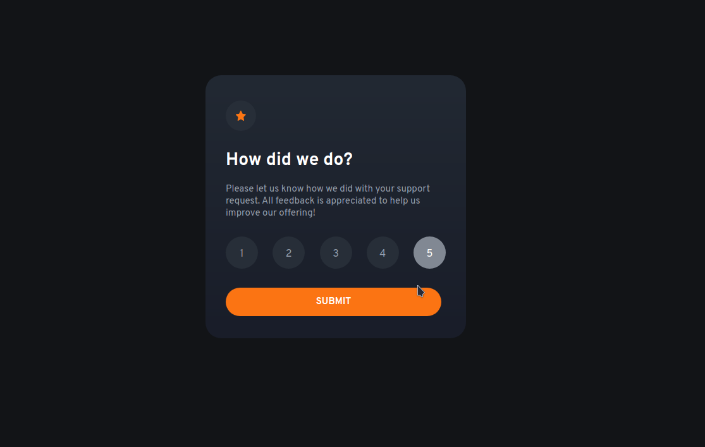

# Frontend Mentor - Interactive rating component solution

This is a solution to the [Interactive rating component challenge on Frontend Mentor](https://www.frontendmentor.io/challenges/interactive-rating-component-koxpeBUmI). Frontend Mentor challenges help you improve your coding skills by building realistic projects.

## Table of contents

- [Overview](#overview)
  - [The challenge](#the-challenge)
  - [Screenshot](#screenshot)
  - [Links](#links)
- [My process](#my-process)
  - [Built with](#built-with)
  - [What I learned](#what-i-learned)
  - [Continued development](#continued-development)
  - [Useful resources](#useful-resources)
- [Author](#author)
- [Acknowledgments](#acknowledgments)

**Note: Delete this note and update the table of contents based on what sections you keep.**

## Overview

A fun challenge from the frontend mentor website.

### The challenge

Your challenge is to build out this interactive rating component and get it looking as close to the design as possible.

You can use any tools you like to help you complete the challenge. So if you've got something you'd like to practice, feel free to give it a go.

Your users should be able to:

- View the optimal layout for the app depending on their device's screen size
- See hover states for all interactive elements on the page
- Select and submit a number rating
- See the "Thank you" card state after submitting a rating

### Screenshot

### Links

- Live Site URL: [Add live site URL here](http://thedudeway.com/interactive-rating-card/)

## My process

Started blocking out the site in HTML and CSS. Once I felt in the design was in a solid place I added in the functionality. The first huddle came with deactivating a button when a new choice is selected. Solving this required an additioanl function to be added to the Event Listener for the button click. I still not have solved getting the span tag that displays the button text to update correctly.

### What I learned

Continuing on my javascript journey I've learned event listeners this go around as well and using functions better. Getting better at for loops but have not mastered nested for loops yet.

### Continued development

Need to continue working on mastering functions and get iterating through array's and objects. Started using the .forEach this time as well as the arrow functions.

### Useful resources

## Author

- Website - [Joe](https://www.thedudeway.com)
- Frontend Mentor - [@yourusername](https://www.frontendmentor.io/profile/theshonuff)
